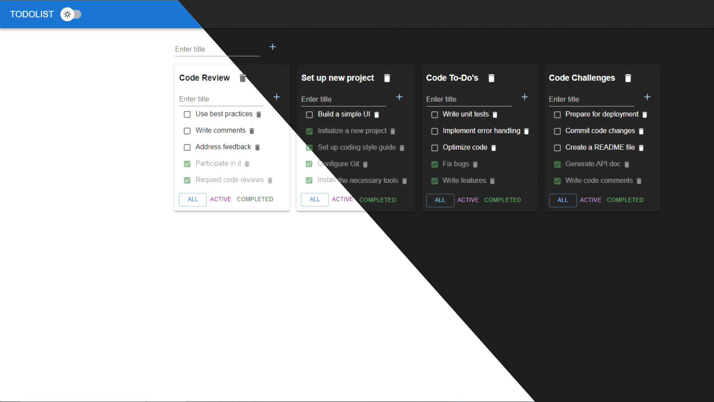

# Todolist

[Demo](https://deniskulik.github.io/todolist/)

## Built With
This is a todolist project built using `React`, `Redux Toolkit`, `TypeScript`, `React Router`, `Axios`, `Formik`, `Jest`, `Storybook`, and `Material UI`.

## Screenshots

## Description
The Todolist project is a comprehensive task management application that allows users to create, edit, and filter tasks. It provides a user-friendly interface for keeping track of to-do items, and it also includes user authentication, enabling users to save their tasks and access them from any device.
